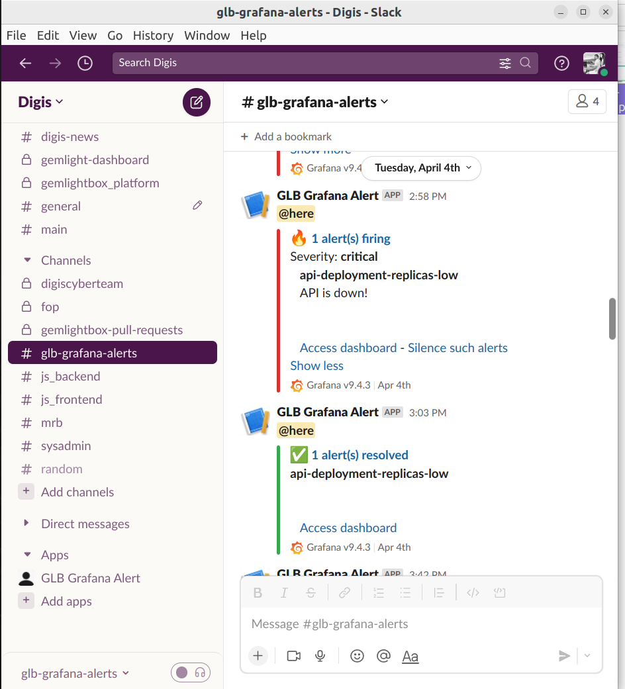
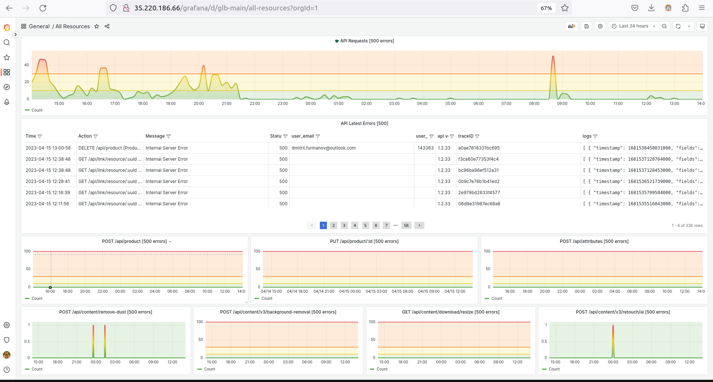
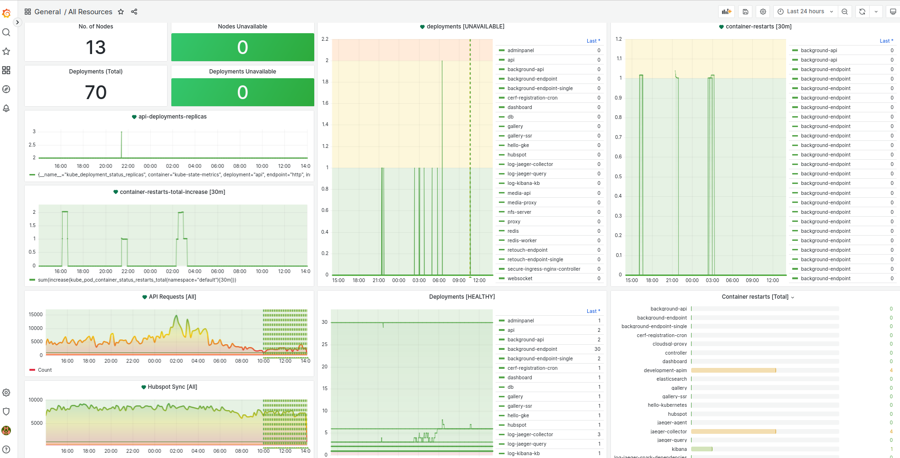
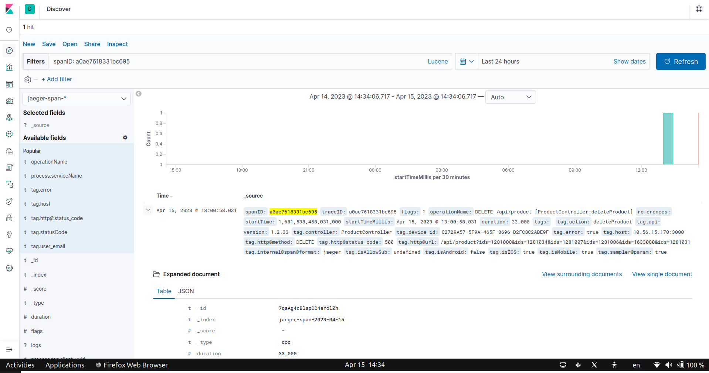
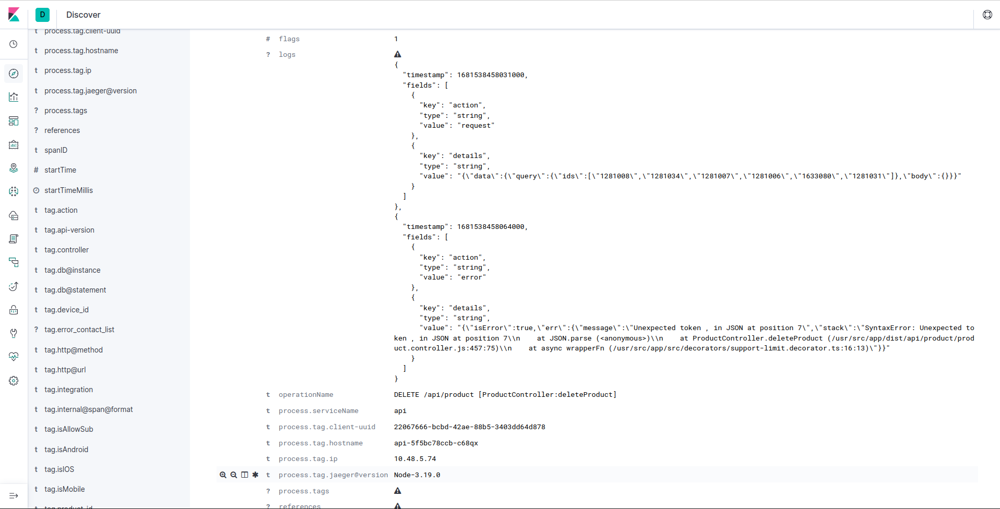
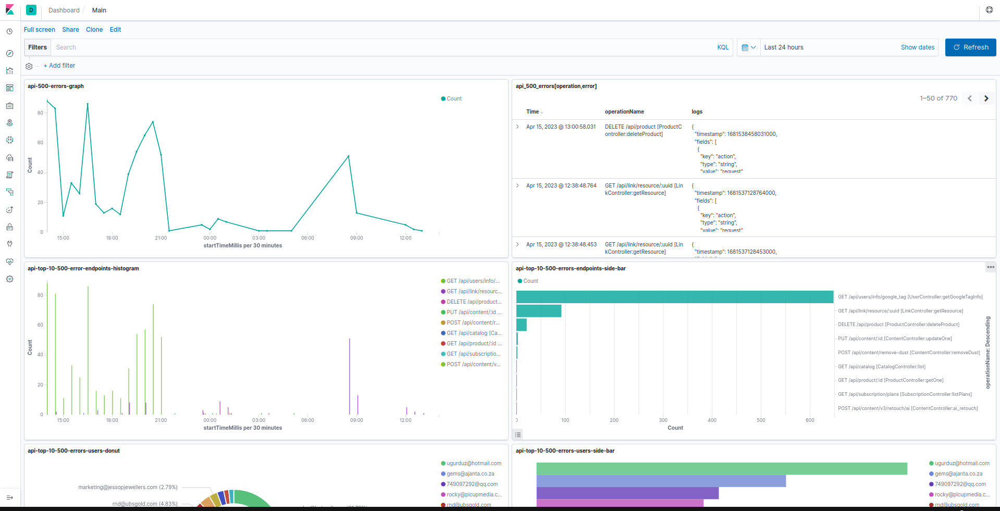
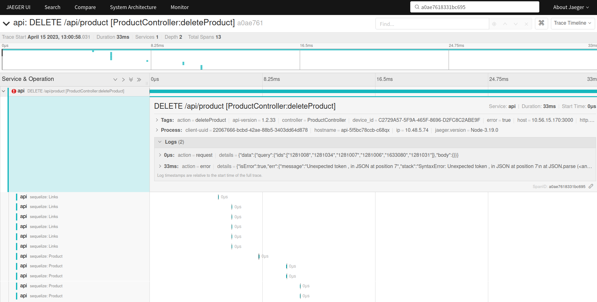
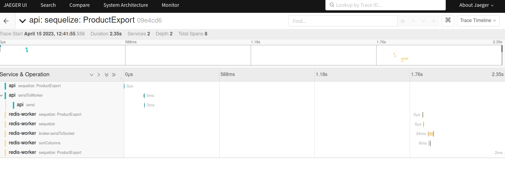

# Тушим пожары и наблюдаем за сервисами используя Jaeger Tracing, Kibana и Grafana

### Что это, какие проблемы решает и кому будет полезно ?

1. **Вы бекенд разработчик**:
- Вам надоело рыться в огромном стоге логов, чтобы узнать в чем дело ?
- Вам прилетела бага которая не репродюсится и вы хотите знать что именно произошло у конкретного пользователя с конкретными данными ?
- У вас микросервисная архитектура и хотелось бы визуализировать кто кого вызывает и что кому отправляет ?

2. **Вы тестировщик**:
- И хотели мы упростить себе процесс тестирования АПИ и получать больше информации о том что пошло не так ?
- Вы бы хотели упростить написание огромного баг репорта с кучей данных и просто указать ID запроса ?

3. **Вы ПМ**:
- И хотите знать о том что упал продакшен или происходят массовые ошибки до того как вам сообщит об этом клиент ?
- Вы хотeли бы получать уведомления в slack, telegram, whatsapp если что то идет не так ?
- Вы хотели бы иметь понятную визуализацию о том что происходит в вашем приложении ?

4. **Вы Клиент**
- И хотите видеть статистику использования той или иной фичи ?
- Вы хотите знать в какое время больше всего пользователей, и что именно они делают ?

### Как будет выглядеть решение ваших проблем ?
Представим такой сценарий: вы в субботу занимаетесь своими делами и тут по какой-то причине 
сервер упал. 
В обычной жизни вы бы и продолжили свои дела, и ваш клиент через 2 дня обнаружил бы что
все плохо, и что так плохо было уже 2 дня, и уволил бы всех за халатность.

## Но теперь: 
### 1. Вы моментально получаете уведомление от Grafana в slack, telegram или whatsapp:

### 2. Вы тут же переходите в Grafana (по ссылке из сообщения) и видите что там произошло:

На всякий случай вы глядите на другие дашборды и видите что также были рестарты сервисов, и падения повторялись уже несколько раз.

В списке последних ошибок в Grafana (API latest errors) вы копируете traceID чтобы затем узнать больше деталей в Kibana.

### 3. В кибане в поиске вы вбиваете traceID и получаете подробную информацию об ошибке:

### 4. На всякий случай заходите на дашборд Kibana и понимаете что таких ошибок было много:
Видно какие ендпоинты, какие пользователи вызывали и сколько всего было ошибок.

Что ж самое время потрусить разрабов (или себя) и попробовать решить эту проблему.
Самое простое, что можно сделать это отправить им traceID, по которому они легко найдут все что им нужно.

### 5. Разраб (или вы) заходит в Jaeger и вбивает в поиск traceID:
Там он видит все детали запроса, какой пользователь, что запрашивал, и какие конкретно функции вызывались.

В данном случае ошибка достаточно простая, и не было вовлечено других сервисов которые на это повлияли.
Но ключевое преимущество Jaeger в том, что он позволяет визуализировать взаимодействие между различными сервисами и функциями.

# Такс, это все круто, но как теперь это сделать ?
Grafana, Kibana только отображают информацию, но основную работу по сбору и отправке данных делает Jaeger.
Поэтому ключевой частью решения является Jaeger основанный на платформе OpenTelemetry.

## Что такое OpenTelemetry ?
OpenTelemetry это стандарт для сбора и отправки данных о том что происходит в приложении.
Этот стандарт используется в различных языках таких как Go, Java, Python, NodeJS, PHP, Ruby, C++ и т.д.
Но мы, в рамках этого руководства, будем использовать NodeJS.

## Тестовое приложение

