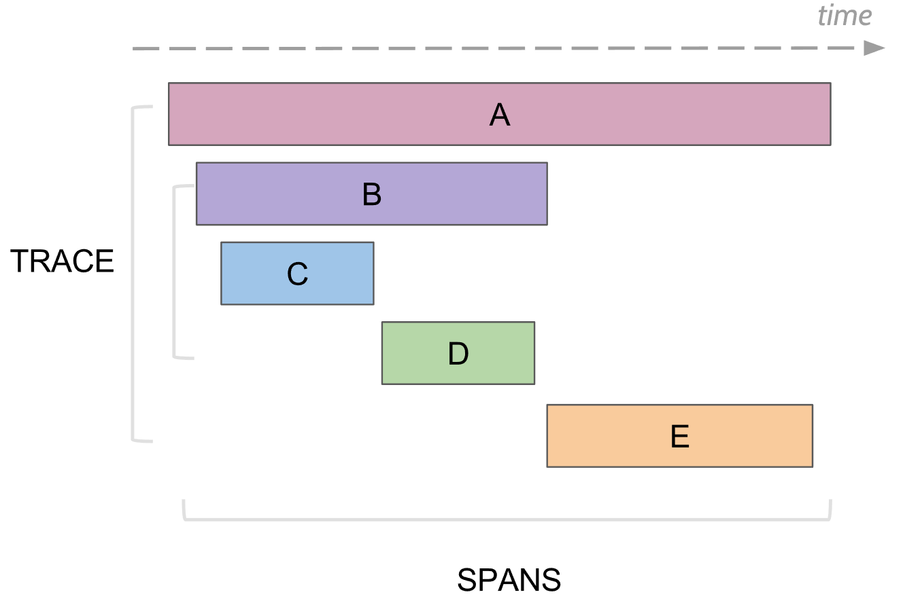
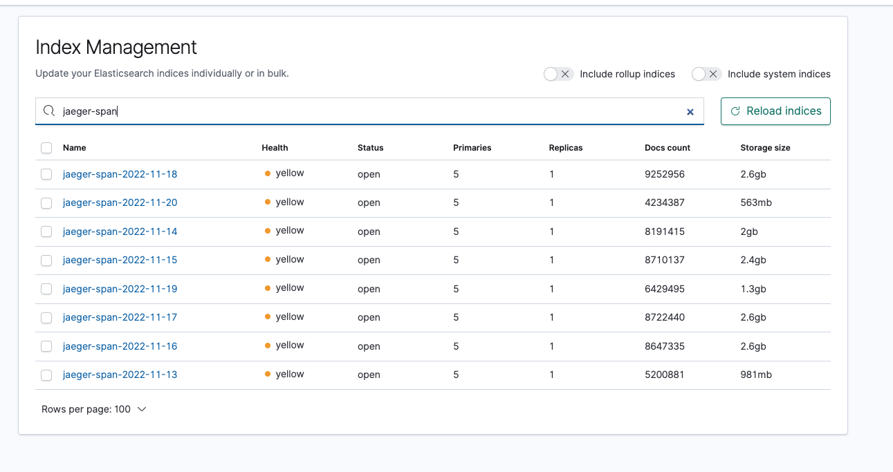

## Какие проблемы можно решить с помощью трассировки

1. Найти узкие места в производительности как внутри одного сервиса, так и во всем дереве выполнения между всеми участвующими сервисами. Например:

- Много коротких последовательных вызовов между сервисами, например, на геокодинг или к базе данных.
- Долгие ожидания ввода вывода, например, передача данных по сети или чтение с диска.
- Долгий парсинг данных.
- Долгие операции, требующие cpu.
- Участки кода, которые не нужны для получения конечного результата и могут быть удалены, либо запущены отложенно.

2. Наглядно понять в какой последовательности что вызывается и что происходит когда выполняется операция.

3. Сбор информации о дереве исполнения для последующего отложенного анализа. 
На каждом этапе выполнения в трейс можно добавить информацию, которая доступна на данном этапе и дальше разобраться какие входные данные привели к подобному сценарию. Например:

- ID пользователя
- Права
- Тип выбранного метода
- Лог или ошибка исполнения

4. Превращение трейсов в подмножество метрик и дальнейший анализ уже в виде метрик.

## Инструменты

- **Jaeger** — бекенд написанный на Go он занимается сбором, хранением, анализом и отображением трейсов. У него в комплекте есть UI в котором через браузер можно найти трейсы и провести необходимый анализ либо посмотреть путь трейса. 

Обратите внимание что можно смотреть не только ошибки, но и время работы каждого сервиса и общее время ответа.

> Это распределенная система состоящая из нескольких компонентов:
- **Jaeger-Agent** — рассчитан на то что будет запускаться рядом с вашими сервисами и получать от них трейсы.
- **Jaeger-Collector** — который принимает данные от агентов и сохраняет в хранилище(Cassandar, Elasticsearch или Kafka).
- **Jaeger-Query** — обрабатывает запросы от Jaeger UI.
- **Jaeger-UI** — это веб интерфейс для поиска и просмотров трейсов

### Для тог чтобы просмотреть трейсы нужно:
- Выбрать сервис по которому хочется пофильтровать трейсы
- Дальше выбрать операцию, временной промежуток и минимальное время операции, например от 10 секунд, чтобы взять только долгие выполнения.

Так же если известен какой-то id запроса, то можно найти трейс по этому id через поиск по тегам, если этот id логируется в спан трейса.

## Что умеет логировать трассировка. Span
В трассировке есть понятие спан, это аналог одного лога в консоль. У спана есть:
- Название, обычно это название метода который выполнялся
- Название сервиса, в котором был сгенерирован спан
- Собственный уникальный ID
- Какая-то мета информация в виде key/value, которую залогировали в него. Например, параметры метода или закончился метод ошибкой или нет
- Время начала и конца выполнения этого спана
- ID родительского спана

Каждый спан отправляется в collector спанов для сохранения в базу для последующего просмотра как только он завершил свое выполнение. 
В дальнейшем можно построить дерево всех спанов соединяя по id родителя. 

При анализе можно найти, например, все спаны в каком-то сервисе, которые заняли больше какого-то времени. 
Дальше, перейдя на конкретный спан, увидеть все дерево выше и ниже этого спана.

## Логирование трейсов
Где-то на самом верхнем уровне должен быть создан первый Span, это может быть сделано автоматически например контроллером при получении запроса, либо вручную если такого нет.

Если какой-то метод ниже хочет добавить Span, он берет из контекста текущий activeSpan, создает новый Span и говорит что его родительский полученный activeSpan, и делает новый Span active. При вызове внешних сервисов им передается текущий активный спан, и те сервисы создают новые спаны с привязкой к этому спану.

ВАЖНО!
Всегда закрывайте спан!

## Хранение и визуализация трейсов

Хранить трейсы можно в Cassandra или ElasticSearch.
Если использовать cassandra то по дефолту она хранит трейсы только за два дня. 

У нас используется elasticsearch и трейсы хранятся за последний месяц. 
На каждый день создается отдельный индекс, например jaeger-service-2022-11-04.

Использование ElasticSearch также позволяет более удобно искать по логам и визуализировать накопленные трейсы.

Вы можете создавать различные графики и мониторить все что происходит на вашем ресурсе.

## Практикум: (TODO)
- запуск jaeger локально
- микро приложение, установка зависимостей
- отправка простых трейсов
- отправка вложенных трейсов
- соединение логов нескольких микросервисов

## Деплоймент: (TODO)
- базовый деплоймент с использованием Kubernetes
- подключение ElasticSearch/Kibana
- продакшн настройки/управление доступом

## Бонусы: 

- Библиотека [jaeger-logger](https://www.npmjs.com/package/jaeger-logger)
> Помогает управлять логированием приложения, легко создавать вложенные трейсы, автоматически открывать/закрывать контекст,
> соединять трейсы нескольких микросервисов и многое другое.

